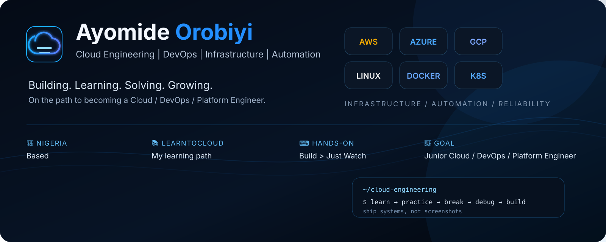

# Hi, I'm Ayomide Orobiyi 👋

### Cloud Engineering | DevOps | Infrastructure | Automation

I'm a Cloud Engineering learner based in Nigeria, focused on developing the practical skills needed to build, troubleshoot, automate, and operate real-world cloud systems.

I'm currently learning through **LearnToCloud** while turning each concept into hands-on labs, projects, debugging exercises, and portfolio work.

## ☁️ What I'm Learning

- Linux & Bash
- Networking, DNS, HTTP/HTTPS & SSH
- Git & GitHub
- Python for cloud automation
- Docker & containers
- Cloud infrastructure & architecture
- IAM, compute, storage & databases
- Infrastructure as Code with Terraform / OpenTofu
- CI/CD with GitHub Actions
- Monitoring, logging & security
- Kubernetes fundamentals
- Reliability, troubleshooting & incident thinking

## 🛠️ How I Learn

I believe cloud engineering is best learned by doing.

**Learn → Practice → Break → Debug → Build → Explain → Review**

Rather than only following tutorials, I focus on building systems, intentionally breaking them, investigating failures, and understanding why the fixes work.

## 🚀 Current Focus

I'm building toward junior **Cloud / DevOps / Platform Engineering** roles by developing practical projects that demonstrate:

- Infrastructure and automation
- Linux administration
- Cloud networking
- Containerization
- Infrastructure as Code
- CI/CD
- Troubleshooting
- Security and cost awareness

## 📂 What You'll Find Here

This GitHub will contain my:

- Cloud engineering labs
- Infrastructure projects
- Automation scripts
- Dockerized applications
- CI/CD pipelines
- Troubleshooting and break-fix exercises
- Architecture documentation
- Notes and lessons learned

## 🎯 Goal

My goal is to become an engineer who can **build, troubleshoot, explain, and operate real systems independently** — not simply complete tutorials.

---

📍 Nigeria · 📚 LearnToCloud · 🔧 Learning by building
